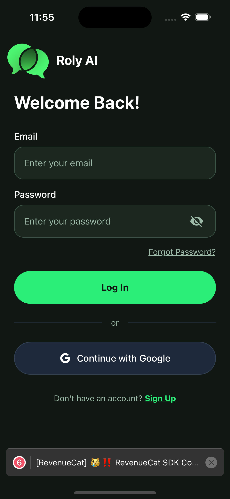
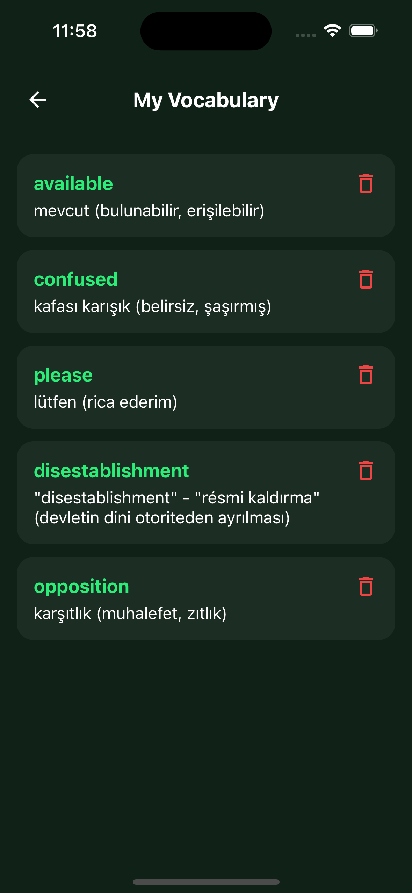
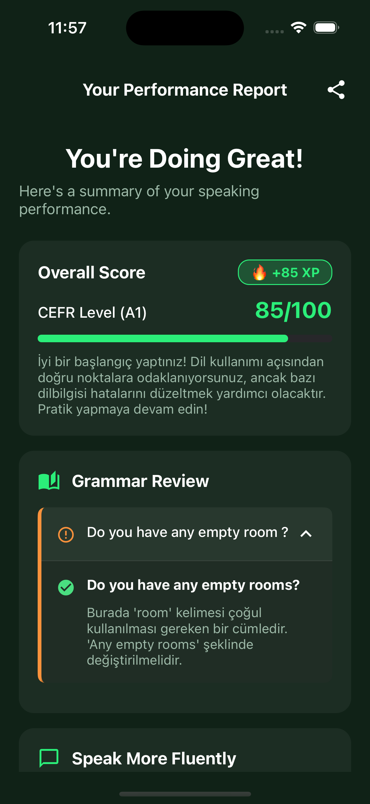
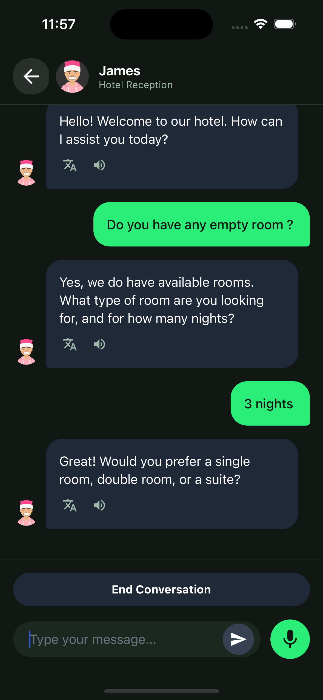
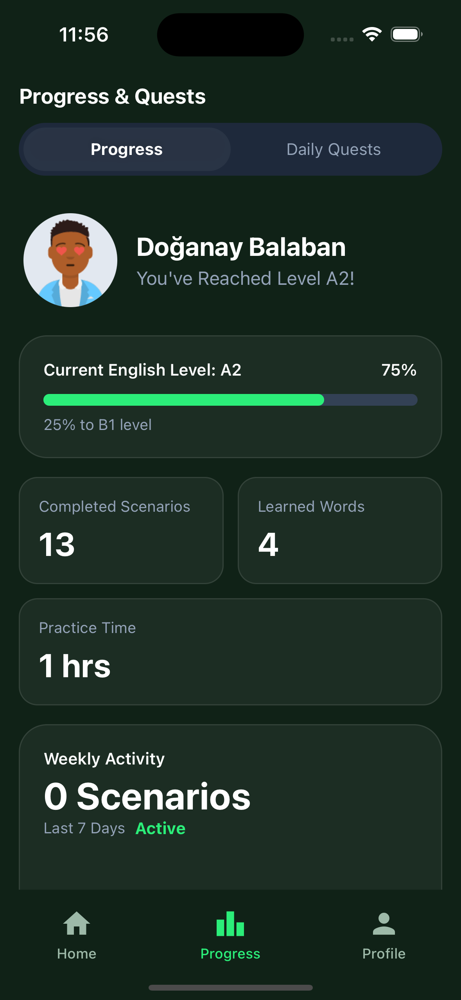
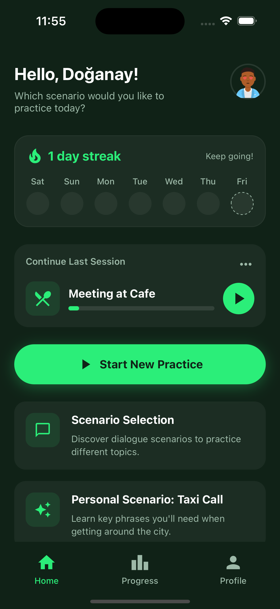

# RolyAI
RolyAI is an AI-powered language-learning platform focused on speaking, not memorizing.
It puts learners into real-life roleplay conversations so practice feels practical.
Instant feedback helps fix pronunciation and grammar before bad habits stick.
The goal is confidence for meetings, travel, and everyday conversations.
This repo ships the landing site + waitlist, a mobile app, and the API server.

**Live Demo**
- App: https://rolyai.vercel.app/
- GitHub repo: https://github.com/DoganayBalaban/Roly-AI-Learn-Languages-Through-Real-Life-Roleplay

## Problem
Most language apps train vocabulary and reading, but people freeze when it matters: speaking. Learners lack safe, realistic practice and timely feedback, so confidence lags behind knowledge.

## Solution
RolyAI provides AI-driven roleplay conversations with immediate feedback on pronunciation and grammar. The experience is designed to build confidence through realistic practice and progression.

## Key Features
- Real-life roleplay scenarios that mirror everyday situations
- Instant pronunciation + grammar feedback
- Adaptive learning for different proficiency levels
- Gamified progression (XP, streaks, leaderboards)
- Multi-language support (English, Turkish, Spanish, German, French, Italian, Japanese, Korean, Russian)

## Screenshots
<p align="center">
  
  
  
  
  
  
</p>

## Tech Stack
- **Landing**: Next.js (App Router), React, TypeScript, Tailwind CSS, GSAP — fast SSR/SEO for marketing pages, typed UI components, and smooth animation for hero/scroll effects.
- **Mobile**: React Native (Expo), React Navigation, Expo AV/Speech, i18next — single codebase for iOS/Android, built-in media/speech for speaking drills, and i18n for multiple languages.
- **Backend**: Node.js, Express, TypeScript, MongoDB (Mongoose), JWT, Zod — lightweight APIs with schema validation, JWT auth, and document storage that fits conversational data.
- **AI**: OpenAI API — reliable speech/text understanding and generation to power feedback and roleplay.
- **Infra**: Docker, Docker Compose, Resend (waitlist email capture) — reproducible dev/prod setup and simple transactional email for the waitlist.
- **Services**: Google OAuth, RevenueCat, Google AdMob — easy sign-in, subscriptions, and monetization/ads out of the box.


## Architecture Notes
- Monorepo structure with `landing/`, `mobile/`, and `server/` directories
- Next.js Server Actions handle waitlist submissions on the landing page
- Express API handles authentication, users, chat, word, and AI orchestration for the mobile app
- MongoDB stores users, sessions, and vocabulary data
- Docker Compose configuration for easy local development and deployment
- Environment variables are injected via `.env` files for each service

## Getting Started

### Option 1: Docker Compose (Recommended)

Run all services with Docker Compose:

```bash
docker-compose up
```

This will start:
- **Server** on `http://localhost:5000`
- **Landing** on `http://localhost:3000`
- **Mobile** (Expo) on `http://localhost:8081`

For development with hot reload:
```bash
docker-compose up --build
```

### Option 2: Local Development

#### Landing (Next.js)
```bash
cd landing
npm install
npm run dev
```
Runs on `http://localhost:3000`

#### Server (Express)
```bash
cd server
npm install
npm run dev
```
Runs on `http://localhost:5000` (or PORT from .env)

#### Mobile (Expo)
```bash
cd mobile
npm install
npx expo start
```
Starts Expo development server

## Environment Variables

### Landing
| Variable | Purpose |
| --- | --- |
| `RESEND_API_KEY` | Resend API key for waitlist email capture |

### Server
Create a `.env` file in the `server/` directory:

| Variable | Purpose | Default |
| --- | --- | --- |
| `MONGODB_URI` | MongoDB connection string | - |
| `JWT_SECRET` | JWT signing secret for authentication | - |
| `GOOGLE_CLIENT_ID` | Google OAuth client ID | - |
| `OPENAI_API_KEY` | OpenAI API key for AI responses | - |
| `PORT` | Server port | 3000 |

### Mobile
Create a `.env` file in the `mobile/` directory:

| Variable | Purpose |
| --- | --- |
| `EXPO_PUBLIC_GOOGLE_WEB_CLIENT_ID` | Google OAuth web client ID |
| `EXPO_PUBLIC_GOOGLE_IOS_CLIENT_ID` | Google OAuth iOS client ID |
| `EXPO_PUBLIC_API_URL_ANDROID` | API base URL for Android development (e.g., `http://10.0.2.2:5000`) |
| `EXPO_PUBLIC_API_URL_IOS` | API base URL for iOS development (e.g., `http://localhost:5000`) |
| `EXPO_PUBLIC_API_URL_PROD` | API base URL for production |
| `EXPO_PUBLIC_ADMOB_INTERSTITIAL_ID` | Google AdMob interstitial ad unit ID |
| `EXPO_PUBLIC_ADMOB_BANNER_ID` | Google AdMob banner ad unit ID |
| `EXPO_PUBLIC_PRIVACY_URL` | Privacy policy page URL |
| `EXPO_PUBLIC_TERMS_URL` | Terms of service page URL |
| `EXPO_PUBLIC_REVENUECAT_PUBLIC_API_KEY_ANDROID` | RevenueCat public API key for Android |
| `EXPO_PUBLIC_REVENUECAT_PUBLIC_API_KEY_IOS` | RevenueCat public API key for iOS |

## Roadmap
- [TODO] In-app speaking sessions with richer feedback UI
- [TODO] Leaderboard
- [TODO] Multi-language content packs and scenario expansion
- [TODO] App store launch and public beta rollout

## Contributing
Issues and PRs are welcome. Please open an issue first for large changes so we can align on scope.